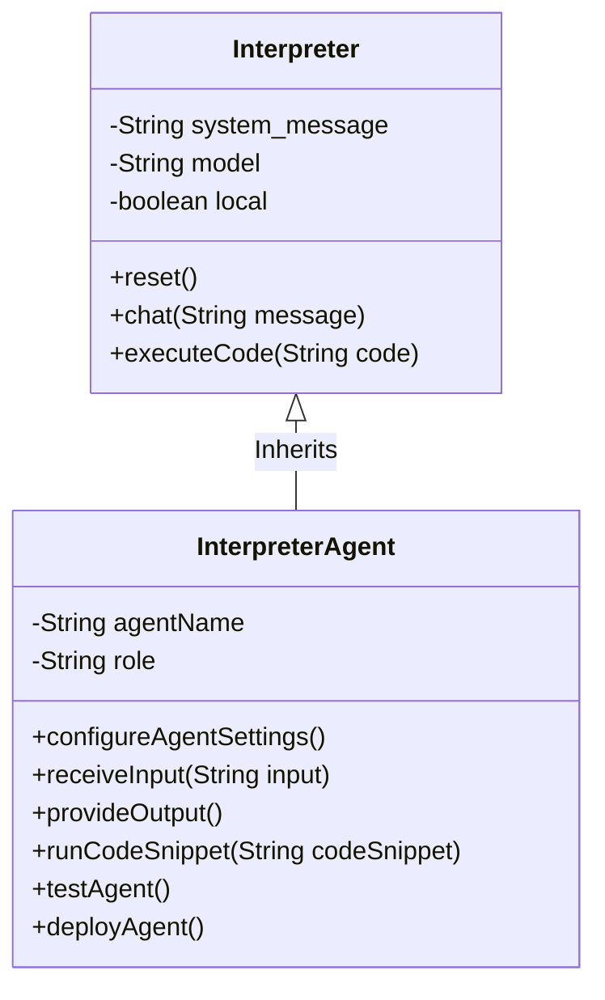

```mermaid
classDiagram
    class Interpreter {
        -String system_message
        -String model
        -boolean local
        +reset()
        +chat(String message)
        +executeCode(String code)
    }

    class InterpreterAgent {
        -String agentName
        -String role
        +configureAgentSettings()
        +receiveInput(String input)
        +provideOutput()
        +runCodeSnippet(String codeSnippet)
        +testAgent()
        +deployAgent()
    }

    Interpreter <|-- InterpreterAgent: Inherits
```
